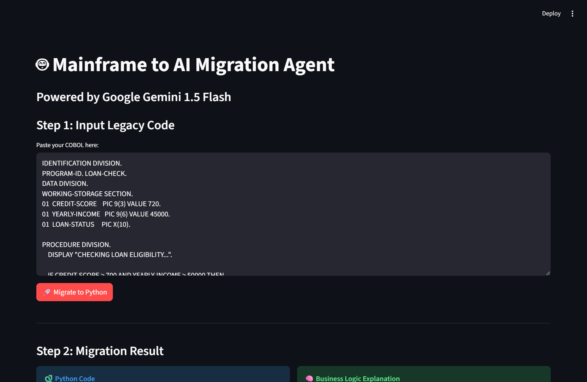
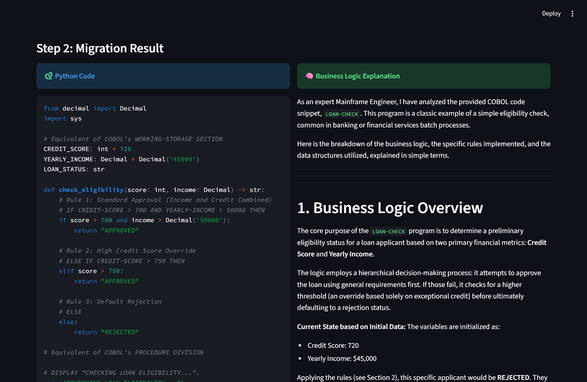

# 🏦 Legacy Code Migration Agent
### Autonomous AI Agent for Modernizing Mainframe Systems

**Project Status:** ✅ Active | **Tech Stack:** Google Gemini Flash (Latest), LangGraph, Streamlit, Python

---

## 📖 The Problem
Global banking and insurance sectors still run on billions of lines of legacy code (COBOL/JCL). Migrating this logic to the cloud is:
* **Risky:** Business logic is often undocumented and fragile.
* **Expensive:** Manual rewriting costs millions and takes years.
* **Complex:** Modern developers often lack Mainframe expertise.

## 💡 The Solution
I built an **Agentic AI Workflow** that autonomously analyzes, documents, and refactors legacy code into modern, enterprise-grade Python.

Unlike simple "code translators," this agent uses a **Multi-Step Reasoning Graph** (LangGraph) to ensure business logic is preserved, not just syntax.

### Key Features
* **🧠 Logic Analysis:** First understands the *intent* of the COBOL code (e.g., "This is a loan approval gate") before writing a single line of Python.
* **🐍 Enterprise Python Refactoring:** Generates clean, object-oriented Python using Type Hinting, `Decimal` for financial precision, and modular functions.
* **🛡️ Self-Healing Mechanism:** Includes robust error handling and retry logic to handle API rate limits gracefully.
* **⚖️ Business Rule Extraction:** Automatically identifies and comments on critical business rules (e.g., "Score > 700 = Approved").

---

## 🛠️ Tech Stack
* **LLM:** Google Gemini Flash (Model alias: `gemini-flash-latest`)
* **Orchestration:** LangGraph (Stateful Agent Workflow)
* **Framework:** LangChain
* **UI:** Streamlit
* **Language:** Python 3.10+
* **Utilities:** Tenacity (for retry logic), AST (for robust output parsing)

---

## 🚀 How It Works (The Architecture)

The agent follows a strict **State Machine** workflow:

1.  **Input:** User pastes legacy COBOL/JCL snippet.
2.  **Node 1 (Analyst):** The AI acts as a Senior Mainframe Engineer. It reads the code and generates a natural language explanation of the business rules.
3.  **Node 2 (Developer):** The AI switches personas to a Senior Python Developer. It takes the *explanation* (not just the raw code) and implements it in modern Python.
4.  **Output:** Returns both the documentation and the executable Python code.

---

## 💻 Setup & Installation

**Prerequisites:** Python 3.9+, Google API Key.

1.  **Clone the Repository**
    ```bash
    git clone [https://github.com/YOUR_USERNAME/legacy-migration-agent.git](https://github.com/YOUR_USERNAME/legacy-migration-agent.git)
    cd legacy-migration-agent
    ```

2.  **Create Virtual Environment**
    ```bash
    python -m venv venv
    # Windows:
    venv\Scripts\activate
    # Mac/Linux:
    source venv/bin/activate
    ```

3.  **Install Dependencies**
    ```bash
    pip install -r requirements.txt
    ```

4.  **Configure API Key**
    Create a `.env` file in the root directory:
    ```env
    GOOGLE_API_KEY="your_google_api_key_here"
    ```

5.  **Run the Agent**
    ```bash
    streamlit run app.py
    ```

---

## 📸 Screenshots




---

## 👨‍💻 Author
**Ranjith Ragavan**
*Agentic AI Engineer & Mainframe Modernization Specialist*

* [LinkedIn Profile](https://www.linkedin.com/in/ranjithragavan)
* [Portfolio](https://ranjithragavan.com)